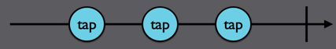
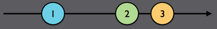

# Observables

## Observables 관련 용어 및 기능

### Observable이란?
Observable이란 여러 이벤트들을 생성(emit)할 수 있는 대상을 말한다.

### sequence란?

Observable == Observable sequence == sequence 셋 모두 같은 표현으로 쓰인다.  
그렇다면 왜 이렇게 부를까?
  
> Observable life cycle
> 

> "Observe" 결과 사건들은 "sequence"라고 할 수 있다.
> 

1. next: 구성요소를 계속해서 방출시킬 수 있는 기능 (=observable 구독자에게 데이터 전달)
2. completed: 이벤트를 종료시킬 수 있는 기능 (=observable 구독자에게 완료되었음을 알림)
- 그림에서 끝에 막대기가 세로로 있는 것(이미 일이 끝난 상태)
