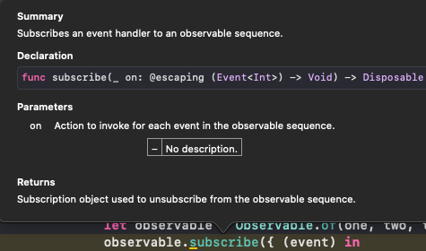

# Observables

## Observables 관련 용어 및 기능

### Observable이란?

Observable이란 여러 이벤트들을 생성(emit)할 수 있는 대상을 말한다.

### sequence란?

Observable == Observable sequence == sequence 셋 모두 같은 표현으로 쓰인다.  
그렇다면 왜 이렇게 부를까?

> Observable life cycle
> 

> "Observe" 결과 사건들은 "sequence"라고 할 수 있다.
> 

1. next: 구성요소를 계속해서 방출시킬 수 있는 기능 (=observable 구독자에게 데이터 전달)
2. completed: 이벤트를 종료시킬 수 있는 기능 (=observable 구독자에게 완료되었음을 알림)

- 그림에서 끝에 막대기가 세로로 있는 것(이미 일이 끝난 상태)

> completed  
> 

3. error: 이벤트에 오류가 있음을 알고 중간에 종료시킬 수 있는 기능(observable 구독자에게 오류를 알림)

- 이벤트에 오류를 포함하고 있는 경우 "X"로 표현

> error  
> 

## Observable(sequence) 생성

1. **Observable.just()**: 오직 하나의 요소를 포함하는 "Sequence" 생성

- [one, two, three]처럼 하나의 배열로도 삽입 가능

```swift
example(of: "just, of, from") {
    // 1
    let one = 1
    let two = 2
    let three = 3

    // 2
    let observable = Observable<Int>.just(one)
}
```

example 메소드

```swift
public func example(of description: String,
                    action: () -> Void) {
    print("\n--- Example of:", description, "---")
    action()
}
```

2. **Observable.of()**: 타입 추론을 이용하며 "Sequence" 생성

- 3개의 integer 값에 대한 sequence 생성

```swift
let observable2_1 = Observable.of(one, two, three)
```

.of()로 단일요소 만들기(.just()와 동일한 결과)

```swift
let observable3_1 = Observable.of([one, two, three])
let observable3_2 = Observable.just([one, two, three])
```

[one, two, three]와 (one, two, three)의 차이를 주의(단일 요소인 배열, 배열이 아닌 다중 요소)

3. Observable.from(): 오직 array 타입만 처리하며 각각 요소들을 하나씩 "emit"하는 기능

```swift
let observable4= Observable.from([one, two, three])
```

4. Observable.create()  
   클로저 형식이며 다양한 값(onNext, onCompleted, ...)을 생성할 수 있음  
   disposeBag: 쓰레기봉투

```swift
example(of: "create") {
    let disposeBag = DisposeBag()

    let observable = Observable<String>.create({ (observer) -> Disposable in

        observable.onNext("1")

        observable.onCompleted()

        observable.onNext("?")

        return Disposables.create()
     })

     observable.subscribe{ (event) in
        print(event)
     }

     /* print
        next(1)
        completed
     */
}

// Disposeables와 subscribe 내용은 뒤에서 계속
```

5. Observable.empty()
6. Observable.never()
7. Observable.range(start:1, count:10)
8. Observable.create()

### Observable subscribing

"옵저버에 대한 구독" 즉, 옵저버에 담긴 이벤트들을 방출(emit)하는 것이 subscribe 메소드를 사용하는 것

1. observable.subscribe()

- 사전 작업: Observable에 요소 추가

```swift
example(of: "subscribe") {
    let one = 1
    let two = 2
    let three = 3

    let observable = Observable.of(one, two, three)
}
```

- 구독하기: subscribe

```swift
observable.subscribe { event in
    print(event)

    /*
    --- Example of: subscribe ---
        next(1)
        next(2)
        next(3)
        completed
    */
}
```

.subscribe는 정수의 이벤트 객체를 파라미터로 하는 escaping 클로저 형식 메소드, 반환 값은 Disposable



2. Observable.subscribe(onNext:)
   next 요소만 처리한다는 의미(위에서 그냥 subscribe 메소드는 completed까지 출력 했지만 이것은 아닌 것을 확인)

```swift
observable.subscribe(onNext: {element in
    print(element)

    /* prints
    1
    2
    3
    */
})
```

3. empty()로 설정된 Observable
   subscribe()시, "completed"만 출력

```swift
 example(of: "empty") {
     let observable = Observable<Void>.empty()

     observable.subscribe(

         onNext: { (element) in
             print(element)
     },

         onCompleted: {
             print("Completed")
     }
     )
 }

 /* Prints:
  Completed
 */
```

4. never()로 설정된 Observable
   subscribe()시, "completed"도 출력되지 않음

```swift
 example(of: "never") {
     let observable = Observable<Any>.never()

     observable
         .subscribe(
             onNext: { (element) in
                 print(element)
         },
             onCompleted: {
                 print("Completed")
         }
     )
 }
```

5. range()로 설정된 Observable
   클로저에서 인수를 주목 "(i) in"

```swift
 example(of: "range") {

     let observable = Observable<Int>.range(start: 1, count: 10)

     observable
         .subscribe(onNext: { (i) in

             let n = Double(i)
             let fibonacci = Int(((pow(1.61803, n) - pow(0.61803, n)) / 2.23606).rounded())
             print(fibonacci)
         })
 }
```

### disposing

subscribe가 Observable안에 있는 이벤트들을 방출(emit)하는 것이라면,
disposing은 subscribe를 취소하는 것

1. dispose()
지금은 Observalble의 이벤트가 3개 있어서 3개 출력 후 "completed"를 출력하지만, Observable의 이벤트가 무한대 등록되어 있다면 일정 수준에서 dispose()에서 종료 후 "completed" 출력

```swift
 example(of: "dispose") {
     
     let observable = Observable.of("A", "B", "C")
     
     let subscription = observable.subscribe({ (event) in
         
         print(event)
     })
     
     subscription.dispose()
 }
```

2. disposeBag
dispose에 대한 리턴값을 담는 객체


```swift
example(of: "DisposeBag") {
    
    let disposeBag = DisposeBag()
    
    Observable.of("A", "B", "C")
        .subscribe{
            print($0)
        }
        .disposed(by: disposeBag) // subscribe로부터 방출된 리턴 값을 disposeBag에 추가
    
    print(disposeBag)
    // prints : RxSwift.DisposeBag
}
```

3. Observable.create에서의 dispose
- completed는 작동하지 않음

```swift
enum MyError: Error {
     case anError
 }
 
 example(of: "create") {
     let disposeBag = DisposeBag()
     
     Observable<String>.create({ (observer) -> Disposable in
         observer.onNext("1")
         
         observer.onError(MyError.anError)
         
         observer.onCompleted()
         
         observer.onNext("?")
         
         return Disposables.create()
     })
         .subscribe(
             onNext: { print($0) },
             onError: { print($0) },
             onCompleted: { print("Completed") },
             onDisposed: { print("Disposed") }
     ).disposed(by: disposeBag) // 이 구문이 있는 이유 : 메로리 제거함으로써 메모리 효율확보
 }
 
 /* Prints:
  1
  anError
  Disposed
 */

```

코드의 흐름: 동기가 아닌 비동기이므로 주의(create 블록과 subscribe 블록 동시에 실행이라고 생각)


4. Observable.deferred()
deferred: 연기된  
"Observable Factory" 개념: lazy var 변수와 같이 Observable.scribe()하는 순간 observable.deferred()가 실행

```swift
example(of: "deferred") {
    let disposeBag = DisposeBag()
    
    var flip = false
    
    let factory: Observable<Int> = Observable.deferred(){
        
        flip = !flip
        
        if flip {
            return Observable.of(1,2,3)
        } else {
            return Observable.of(4,5,6)
        }
    }
    
    for _ in 0...3 {
        factory.subscribe(onNext: {
            print($0, terminator: "")
        })
            .disposed(by: disposeBag)
        
        print()
    }
}
```

### Traits

코드 가독성 상승, Observable 보다 좁은 범위를 선택할 수 있음

1. Single: 성공이냐, 실패냐를 따지는 one-time 일에 적합 (파일 다운로드, 디스크로딩)
- Single(.success(value)) = .next + .completed
- Single(.error(value))

2. Completable: single과 기능이 유사하지만, value값을 emit하지 않음
즉, 일이 제대로 됐는지만 검토할 때 사용(파일 쓰기)
- Completable(.completed)
- Completable(.error(value))

3. Maybe: Single + Completable

ex) Single

```swift
example(of: "Single") {
    let disposeBag = DisposeBag()

    enum FileReadError: Error {
        case fileNotFound, unreadable, encodingFailed
    }

    func loadText(from name: String) -> Single<String> {
        return Single.create{ single in
            let disposable = Disposables.create()

            guard let path = Bundle.main.path(forResource: name, ofType: "txt") else {
                single(.error(FileReadError.fileNotFound))
                return disposable
            }

            guard let data = FileManager.default.contents(atPath: path) else {
                single(.error(FileReadError.unreadable))
                return disposable
            }

            guard let contents = String(data: data, encoding: .ut8) else {
                single(.error(FileReadError.encodingFailed))
                return disposable
            }

            single(.success(contents))
            return disposable
        }
    }

    // test
    loadText(from: "myFile")
            .subscribe{
                switch $0 {
                case .success(let string):
                    print(string)
                case .error(let error):
                    print(error)
                }
            }
            .disposed(by: disposeBag)

    // prints: fileNotFound

}
```

### Do와 debug

1. Observable.do
do 연산자는 Observable이 never이든 뭐든 간에 일단 실행
- Observable.never() 연산자는 "completed"도 출력하지 않음
- 기존에 never를 하면 .subscribe()가 실행되지만 "completed"가 실행되지 않아서 subscribe()를 동작했는지 유무도 알 수 없었음
- do를 사용하면 subscribe()가 발생된지 알 수 있음

```swift
example(of: "never") {
    let observable = Observable<Any>.never()
    
    let disposeBag = DisposeBag()
    
    // 구독했음을 알리는 print("Subscribed")
    observable.do(
        onSubscribe: { print("Subscribed")}
        ).subscribe(
            onNext: { (element) in
                print(element)
        },
            onCompleted: {
                print("Completed")
        }
    )
    .disposed(by: disposeBag)
}

// prints: Subscribed
```

2. Observable.debug()
- debug 연산자로 출력문을 통해 디버그 할 수 있음.
콘솔창 출력 형식: "날짜 시간: \(작성한 문자열) -> <subscribe/isDisposed>"

```swift
example(of: "never") {
    let observable = Observable<Any>.never()
    let disposeBag = DisposeBag()

    observable
        .debug("never 확인")
        .subscribe()
        .disposed(by: disposeBag)

    /* prints
     2020-05-21 19:46:23.534: never 확인 -> subscribed
     2020-05-21 19:46:23.536: never 확인 -> isDisposed
     */
}
```

[Reference](https://ios-development.tistory.com/97)