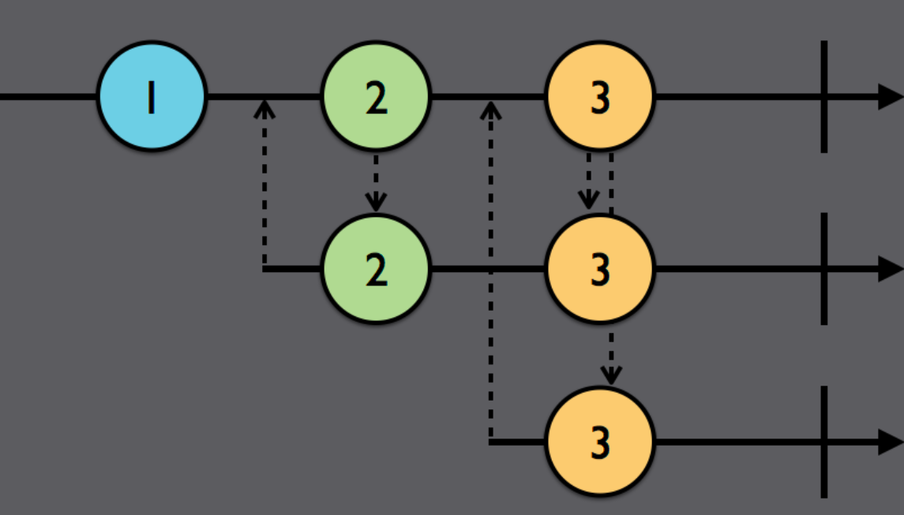

# Subjects

### Subjects란?

(실제 앱 구동시)run time시에 Observable에 값을 추가하여 emit이 발생하게끔 해주는 대리인  
Observable에 값을 추가하는 대상은 Observer라 부르며(추상적인 개념),
Observable과 Observer 기능을 둘 다 하는 것이 바로 Subjects이다. (subscriber가 아님을 주의)  
  
ex) PublishSubjects는 일종의 출판사와 같은 작업
-> 출판사에서 "Is Anyone Listening?"이란 내용 받음(onNext)  
-> 구독(.subscribe)  
-> 현재 벌어진 일만 emit함(.subscribe 했을 경우 "Is anyone listening?"은 과거에 발생했던 일이라 emit하지 않음)  
-> 뒤에 1과 2 이벤트 추가 시(현재 벌어진 일), 이것들은 emit 함  

```swift
example(of: "PublishSubject") {

	let subject = PublishSubject<String>()

	subject.onNext("Is anyone listening?")

	let subscriptionOne = subject
		.subscribe(onNext: { (string) in
				print(string)
			})
	subject.on(.next("1")) //Print: 1
	subject.onNext("2") //Print: 2
}
```

### Subject의 종류

1. PublishSubject: empty 상태로 시작, 새로운 이벤트만 subscriber에게 emit
- 구독된 순간 새로운 이벤트 수신을 알리고 싶을 때 사용


첫 번째 가로 줄: subjects 배포
두, 세번째 가로 줄: subscriber
아래로 향하는 점선 화살표: 이벤트 emit
위로 향하는 점선 화살표: 구독 요청

```swift
example(of: "PublishSubject") {
	let subject = PublishSubject<String>()
	subject.onNext("Is anyone listening?")

	// 첫 번째 구독 요청
	let subscriptionOne = subject
		.subscribe(onNext: { (string) in
			print(string)
		})

	subject.on(.next("1"))
	subject.onNext("2")
	// prints: 1, 2

	// 두 번째 구독 요청
	let subscriptionTwo = subject
		.subscribe({ (event) in
			print("2)", event.element ?? event)
		})

	subject.onNext("3") // print: 2) 3

	subscriptionOne.dispose()
	subject.onNext("4") // print: 2) 4

	subject.onCompleted() // print: 2) completed

	subject.onNext("5") // none of print

	subscriptionTwo.dispose()

	let disposeBag = DisposeBag()

	subject
		.subscribe {
			print("3)", $0.element ?? $0) // print: 3) completed
	}
		.disposed(by: disposeBag)

	subject.onNext("?") // none of print
}
```

#### 해석
- PublishSubject는 현재 구독 요청한 대상만 관심을 갖음(subject.onNext("3")에서 subscriptionOne 관련 된 호출하지 않음)
- 이벤트 추가할 땐, "subject."으로 접근하여 추가(onNext, on)
- subject.onComplete()할 시 구독 종료
  
- subscriber에게 이벤트를 emit시키는 방법
	- 기본 subscriber가 있을 때, subject.onNext()한 경우
	- 새로운 subscriber가 subscribe한 경우

#### PublishSubject 사용
- 시간에 민감한 데이터를 모델링 할 경우(실시간 경매 앱 - 10:00am 경매 시작일 경우, 10:01am에 접속했을 때 알림이 보내질 필요가 없는 경우)


---

