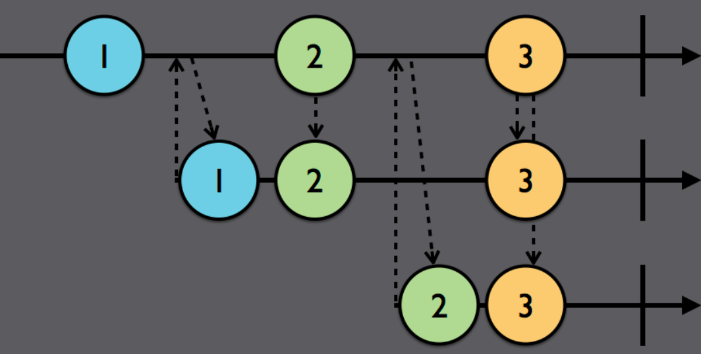

# Subjects

### Subjects란?

(실제 앱 구동시)run time시에 Observable에 값을 추가하여 emit이 발생하게끔 해주는 대리인  
Observable에 값을 추가하는 대상은 Observer라 부르며(추상적인 개념),
Observable과 Observer 기능을 둘 다 하는 것이 바로 Subjects이다. (subscriber가 아님을 주의)  
  
ex) PublishSubjects는 일종의 출판사와 같은 작업
-> 출판사에서 "Is Anyone Listening?"이란 내용 받음(onNext)  
-> 구독(.subscribe)  
-> 현재 벌어진 일만 emit함(.subscribe 했을 경우 "Is anyone listening?"은 과거에 발생했던 일이라 emit하지 않음)  
-> 뒤에 1과 2 이벤트 추가 시(현재 벌어진 일), 이것들은 emit 함  

```swift
example(of: "PublishSubject") {

	let subject = PublishSubject<String>()

	subject.onNext("Is anyone listening?")

	let subscriptionOne = subject
		.subscribe(onNext: { (string) in
				print(string)
			})
	subject.on(.next("1")) //Print: 1
	subject.onNext("2") //Print: 2
}
```

### Subject의 종류

1. PublishSubject: empty 상태로 시작, 새로운 이벤트만 subscriber에게 emit
- 구독된 순간 새로운 이벤트 수신을 알리고 싶을 때 사용


첫 번째 가로 줄: subjects 배포
두, 세번째 가로 줄: subscriber
아래로 향하는 점선 화살표: 이벤트 emit
위로 향하는 점선 화살표: 구독 요청

```swift
example(of: "PublishSubject") {
	let subject = PublishSubject<String>()
	subject.onNext("Is anyone listening?")

	// 첫 번째 구독 요청
	let subscriptionOne = subject
		.subscribe(onNext: { (string) in
			print(string)
		})

	subject.on(.next("1"))
	subject.onNext("2")
	// prints: 1, 2

	// 두 번째 구독 요청
	let subscriptionTwo = subject
		.subscribe({ (event) in
			print("2)", event.element ?? event)
		})

	subject.onNext("3") // print: 2) 3

	subscriptionOne.dispose()
	subject.onNext("4") // print: 2) 4

	subject.onCompleted() // print: 2) completed

	subject.onNext("5") // none of print

	subscriptionTwo.dispose()

	let disposeBag = DisposeBag()

	subject
		.subscribe {
			print("3)", $0.element ?? $0) // print: 3) completed
	}
		.disposed(by: disposeBag)

	subject.onNext("?") // none of print
}
```

#### 해석
- PublishSubject는 현재 구독 요청한 대상만 관심을 갖음(subject.onNext("3")에서 subscriptionOne 관련 된 호출하지 않음)
- 이벤트 추가할 땐, "subject."으로 접근하여 추가(onNext, on)
- subject.onComplete()할 시 구독 종료
  
- subscriber에게 이벤트를 emit시키는 방법
	- 기본 subscriber가 있을 때, subject.onNext()한 경우
	- 새로운 subscriber가 subscribe한 경우

#### PublishSubject 사용
- 시간에 민감한 데이터를 모델링 할 경우(실시간 경매 앱 - 10:00am 경매 시작일 경우, 10:01am에 접속했을 때 알림이 보내질 필요가 없는 경우)


---

2. BehaviorSubject: 하나의 초기값으로 시작, 최산 값(.next)만 새로운 subscriber에게 emit

  
subscribe: 1번째 가로 줄  
subscriber: 2, 3번째 가로 줄  
첫 번째 이벤트가 발생한 후 첫 번째 subscriber(두 번째 줄)가 구독을 시작했지만, 1을 받음(PublishSubject였다면 못 받음)  
두 번째 이벤트가 발생한 후 두 번째 subscriber(세 번째 줄)가 구독을 시작했지만, 2을 받음  
  
```swift
enum MyError: Error {
	case anError
}

example(of: "BehaviorSubject") {

	// BehaviorSubject는 초기 값이 필수이므로 초기화 값을 삽입
	let subject = BehaviorSubject(value: "Initial value")
	let disposeBag = DisposeBag()

	subject.onNext("X")

	subject
		.subscribe{
			print("1)", $0)
		}
		.disposed(by: disposeBag)
	// print: 1) next(X)
	
	subject.onError(MyError.anError)
	// print: 1) error(anError)

	subject
		.subscribe {
			print("2)", $0)
		}	
		.disposed(by: disposeBag)
	// print : 2) error(anError)
}
```

#### 해석
BehaviorSubject는 초기화 값이 필수이며, 항상 저장되어있는 최신값을 emit

#### BehaviorSubject 사용: 뷰를 가장 최신의 데이터로 미리 채우기에 용이(유저 프로필 화면을 BehaviorSubject에 바인딩)

---

3. ReplaySubject: 버퍼 사이즈를 지정하며, 버퍼 사이즈만큼 새로운 subscriber에게 emit

버퍼 사이즈가 2인 경우  
  
subscribe: 1번째 줄
subscriber: 2,3번째 줄

첫 subscriber(2번째 줄)이 구독 신청을 하면 최대 2개 emit 받음(버퍼 사이즈가 2인 경우)
두 번째 subscriber(3번째 줄)이 구독 신청을 하면 최대 2개를 emit받음(버퍼 사이즈가 2인 경우)
  
* 버퍼 사이즈는 메모리에 할당되므로 버퍼 사이즈가 커질 수록 메모리에 큰 부하를 갖는 것을 주의

```swift
example(of: "ReplaySubject") {
	let subject = ReplaySubject<String>.create(bufferSize: 2)
	let disposeBag = DisposeBag()

	subject.onNext("1")
	subject.onNext("2")
	subject.onNext("3")

	subject
		.subscribe {
			print("1)", $0)
		}
		.disposed(by: disposeBag)
	/* prints
	1) next(2)
	1) next(3)
	*/

	subject
		.subscribe {
			print("2)", $0)
		}
		.disposed(by: disposeBag)
	/* prints
	2) next(2)
	2) next(3)
	*/


	subject.onNext("4")
	/* prints
	1) next(4)
	2) next(4)
	*/

	subject.onError(MyError.anError)
	/* prints
	1) error(anError)
	2) error(anError)
	*/
	// subject.dispose()

	subject.subscribe {
		print("3)", $0)
		}
		.disposed(by: disposeBag)
	/* prints:
	3) next(3)
	3) next(4)
	3) error(anError)
	*/
}
```

#### 해석
- 버퍼 사이즈가 2이므로 subscribe하면 항상 2개씩 emit
- subject.onError()해도 print(3,$0)부분에서 next(3), next(4)가 출력됨(문제)
해결) subject.onError()후에 subject.dispose()를 넣으면 됨(위 코드에서 주석 제거)

```swift
/* prints
1) error(anError)
2) error(anError)
3) error(Object 'RxSwift.(unknown context at $10caefbc0).ReplayMany<Swift.String>' was already disposed.)
*/
```

* ReplaySubject 사용: 최신 데이터 여러 개를 보여주고 싶은 경우(최근 검색 5개 현황)

---

4. PublishRelay, BehaviorRelay: 오직 .next 이벤트만 emit함(.completed, .error 무시, non-terminating에서 유용하게 사용)
- PublishRelay: PublishSubject를 단순히 wrap한 것이며 .next만 가능하고 기능 동일
- BehaviorRelay: BehaviorSubject를 단순히 wrap한 것이며 .next만 가능하고 기능 동일
relay의 핵심은 절대 끝나지 않음을 보장하는 것  
  
(PublishRelay)  
```swift
import RxSwift
import RxCocoa // 필요

example(of: "PublishRelay") {
	let relay = PublishRelay<String>()

	let disposeBag = DisposeBag()

	realy.accept("Knock knock, anyone home?")

	relay
		.subscribe(onNext: {
			print($0)
		})
		.disposed(by: disposeBag)

	relay.accept("1") // print: 1

	// error와 onCompleted()사용 불가
	// relay.accept(MyError.anError)
	// relay.onCompleted()

}
```

#### 해석
- relay의 추가는 .accept()로 접근
- error, onCompleted() 사용 불가

(BehaviorRelay)  
```swift
import RxSwift
import RxCocoa

example(of: "BehaviorRelay") {
	let relay = BehaviorRelay(value: "Inital value")
	let disposeBag = DisposeBag()

	relay.accept("New initial value")

	relay
		.subscribe {
			print("1)", $0)
		}
		.disposed(by: dispoesBag)
		// print: 1) next(New initial value)

		// 1
		relay.accept("1")
		// print: 1) next(1)

		// 2
		relay
			.subscribe {
				print("2)", $0)
			}
			.disposed(by: disposeBag)
		// print: 2) next(1)

		// 3
		relay.accept("2")
		/* prints
		2) next(2)
		*/
}
```

#### 해석
.accept()로 다가가며 error, onCompleted를 못 쓴다는 것만 제외하면 BehaviorSubject와 동일  
  

5. AsyncSubject: 마지막의 이벤트만 subscriber에게 emit (단 .completed 이벤트를 받은 경우만)
- .onNext()메소드도 사용 불가, 오직 accept(:\_)만 사용가능 

### Challenges - PublishSubject를 이용하여 불랙잭 딜러 만들기

#### 주어진 조건
- point(for:): hand(가진 카드 배열)의 모든 합을 반환
- PublishSubject 객체

```swift
let disposeBag = DisposeBag()
let dealtHand = PublishSubject<[(String, Int)]>()
```

#### 문제
(1) 현재 가진 카드 총합이 21보다 크면 error 이벤트를, 작으면 다음 이벤트에 카드 배열 추가  
(2) 위 이벤트를 구독하는 코드

##### sol 1
```swift
if point(for: hand) > 21 {
	dealtHand.onError(HandError.busted) // HandError.busted는 따로 enum으로 정의한 것
} else {
	dealtHand.onNext(hand)
}
```

##### sol 2
```swift
dealtHand
	.subscribe (
		onNext: {
			print(cardString(for: $0), "for", points(for: $0), "points")
		},
			onError: {
			print(String(describing: $0).capitalized)
	})
	.disposed(by: disposeBag)
```

[Reference](https://ios-development.tistory.com/98#recentComments)