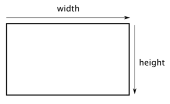
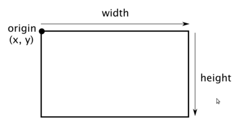
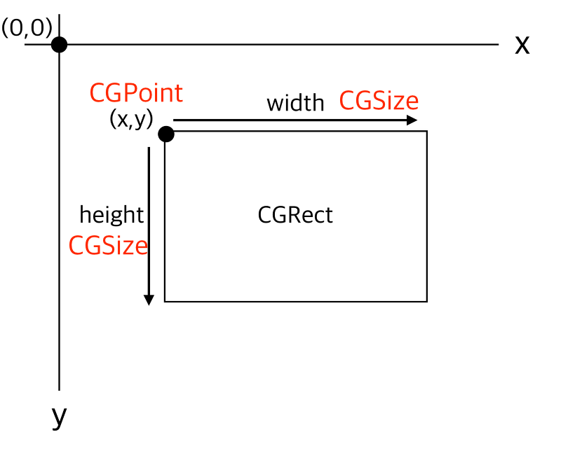

# CGRect, CGSize, CGPoint

## CGPoint란?

```
A structure that contains a point in a two-dimensional coordinate system.

2차원 좌표계의 점을 포함하는 구조체
```

x, y축 점을 찍은 것 처럼 표현하기 위해서 사용한다.

```swift
public static CGPoint {
    public var x: CGFloat
    public var y: CGFloat
    public init()
    public init(x: CGFloat, y: CGFloat)
}
```

이렇게 CGPoint를 코드로 살펴보면 x, y 좌표를 갖고 있는 구조체이다.

## CGSize란?

```
A structure that constaints width and height values.

너비와 높이 값을 포함하는 구조체
```

CGSize도 사각형으로 나타내지곤 하지만 CGSize는 **너비와 높이 값** 이다. 실제로는 사각형으로 간주되지 않는다. 하지만 일러스트레이션을 위해 다음 그림처럼 나타내지기도 한다.



보통 위와 같이 그려지기 때문에 헷갈리는 사람들이 많다.

```swift
public static CGSize {
    public var width: CGFloat
    public var height: CGFloat
    public init()
    public init (width: CGFloat, height: CGFloat)
}
```

코드를 살펴보면 정말 너비와 높이 값만 가지고 있다.

## CGRect란?

```
A Structure that contains the loaction and dimensions of a rectangle.

사각형의 위치와 크기를 포함하는 구조체
```

CGRect는 이름과 같이 **사각형**이다.
CGRect 너비와 높이를 가지고 있을 뿐만 아니라 원점(origin)을 가지고 있다.



CGSize와 달리 origin을 갖고 있다.

```swift
public static CGRect {
    public var origin: CGPoint
    public var size: CGSize
    public init()
    public init(origin: CGPoint, size: CGSize)
}
```

origin의 타입은 **CGPoint**, size의 타입은 **CGSize**이다.

iOS에서는 "위치"를 알아야 사각형을 그릴 수 있기 때문이다.



위 그림과 같이 위치를 CGPoint, 크기 즉 너비와 높이는 CGSize로 나타내는 것이다.

[Reference](https://zeddios.tistory.com/201)
