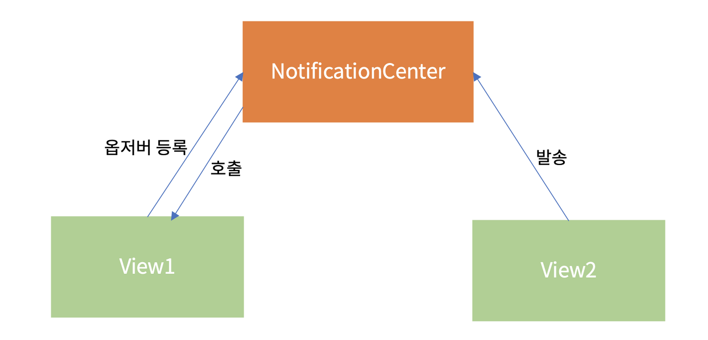

# Change Button's Y Position

> EZY 개발을 하던 중 키보드가 활성화 됐을 때 버튼을 올려줘야하는 난관에 봉착했다..😱 다음 번에 만났을 땐 손쉽게 해결하기 위해서, 기억하기 위해서 이 TIL을 작성한다!🧐

**[키보드 입력 시 레이아웃 오류 발생!! - 해결 방법]()**

사실 생각보단 방법이 간단하고 코드 또한 길지 않아 놀라웠다. 하지만 코드를 하나하나 이해하는 것 또한 중요하기에 작성하면서 다시 한 번 정리해보자!

- `UITextField`, `UIButton` 배치를 완료했다는 전제하에 진행한다.
- UITextField는 `textField`, UIButton은 `YButton`로 선언했다.

`keyboardWillShow`, `keyboardWillHide` 두 가지 function을 이용해 키보드가 보일 때, 보이지 않을 때 각각 변화를 주는 것이다.

---

## 어떻게 사용할까? 😲

`NotificationCenter`을 이용한 코드를 사용한다.

### **NotificationCenter**, 그건 또 뭐야? 😵‍💫



> NotificationCenter에 등록된 event가 발생하면 해당 event에 대한 행동을 취하는데, 보통 백그라운드 작업의 결과, 비동기 작업의 결과 등 현재 작업의 흐름과 다른 흐름의 작업으로부터 이벤트를 받을 때 사용한다.

#### Notification란? 💁‍♀️

NotificationCenter를 통해 정보를 저장하기 위한 **구조체**이다.

```swift
var name: Notification.Name // 알림을 식별하는 태그
var object: Any? // 발송자가 observer에게 보내려고 하는 객체. 주로 발송자 객체를 전달하는 데 쓰인다
var userInfo: [AnyHashable : Any]? // Notification과 관련된 값 또는 객체의 저장소
```

#### NotificationCenter란? 💁‍♀️

등록된 `observer`에게 동시에 `notification`을 **전달**하는 클래스이다.<br>
`NotificationCenter`는 `notification`을 발송하면 NotificationCenter에서 메세지를 전달한 **observer를 처리할 때까지** 대기한다. 즉, 흐름이 **동기적**으로 흘러간다는 말이다.

```swift
// Notification 발송
 NotificationCenter.default.post(name: NSNotification.Name("TestNotification"), object: nil, userInfo: nil)
```

**`.post`** 는 `Name`의 해당자들에게(observer) 일을 수행하라고 시킨다.

```swift
 // observer 등록
 NotificationCenter.default.addObserver(self, selector: #selector(didRecieveTestNotification(_:)), name: NSNotification.Name("TestNotification"), object: nil)

 @objc
 func didRecieveTestNotification(_ notification: Notification) {
         print("Test Notification")
 }
```

- **`addObserver`**: 관찰자를 대기시킨다.
- **`selector`**: 관찰자가 수행해야 할 업무를 의미한다.

### 그럼 사용해보자! 🧐

```swift
NotificationCenter.default.addObserver(self, selector: #selector(keyboardWillShow(_:)), name:UIResponder.keyboardWillShowNotification, object: nil)

NotificationCenter.default.addObserver(self, selector: #selector(keyboardWillHide(_:)), name: UIResponder.keyboardWillHideNotification, object: nil)
```

### 정리하자면! 🤔

`NotificationCenter`에 각각 `addObserver`하여 등록된 **event**가 발생하면 `selector`에 등록된 각각의 함수들을 실행한다.

<br>

## 버튼을 어떻게 올리는데? 😲

아래 코드는 `keyboardWillShow` 함수로 `YButton`의 `y` 위치를 올려주는 코드이다.

```swift
@objc
func keyboardWillShow(_ sender: Notification) {
    YButton.frame.origin.y = self.view.frame.height/1.7
}
```

### 세세하게 살펴보자 🧐

- `keyboardWillShow` function은 **키보드가 보일 때** 일어나는 이벤트를 작성한다.
- `YButton.frame.origin.y`는 바로 읽을 수 있듯이 `YButton`의 `y` 위치 값을 말한다.
- `self.view.frame.height/1.7`은 바로 알 수 있으니 **PASS!**

### 한 마디로! 🤔

키보드가 보일 때 `YButton`은 `view`의 `height` 값을 1.7로 나눈 위치에 존재한다는 것이다.

<br>

## 그럼 **키보드 높이** 만큼 올려주고 싶다면? 🤯

아래의 코드를 한 번 살펴보자!!

```swift
@objc
func keyboardWillShow(_ sender: Notification) {
    var keyboardHeight: CGFloat = CGFloat(0)
    if let keyboardFrame: NSValue = sender.userInfo?[UIResponder.keyboardFrameEndUserInfoKey] as? NSValue {
        let keyboardRectangle = keyboardFrame.cgRectValue
        keyboardHeight = keyboardRectangle.height
    }
    YButton.frame.origin.y -= keyboardHeight
}
```

### 세세하게 살펴보자 🧐

- `keyboardHeight`라는 변수는 `CGFloat` 형식으로 키보드의 높이를 받아오는 변수이다.
- `if~` 구문은 사용자의 keyboardFrame을 받아온다.
- `keyboardRectangle`은 `keyboardFrame` 값을 받아온 상수이다.
- `keyboardHeight`는 `keyboardRectangle`의 `height`, 즉 **높이**를 받는다.
- `YButton`의 `y` 값을 `keyboardHeight`만큼 `-`하여 버튼은 키보드의 상단에 위치하게 된다.

### 한 마디로! 🤔

키보드가 보일 때 사용자의 키보드 높이를 `keyboardHeight`에 저장하여 `y`값을 `-`하여 키보드의 상단에 `YButton`이 위치할 수 있게 한다는 것이다.

<br>

## 그럼 키보드가 사라졌을 때는? 😲

다음은 `keyboardWillHide` 함수로 `YButton`의 `y` 위치를 다시 내려주는 코드이다.

```swift
@objc
func keyboardWillHide(_ sender: Notification) {
    YButton.frame.origin.y = self.view.frame.height - YButton.frame.height - self.view.frame.height/32.48
}
```

### 세세하게 살펴보자 🧐

- `keyboardWillHide` function은 **키보드가 사라졌을 때** 일어나는 이벤트를 작성한다.
- `YButton.frame.origin.y` 값에 원래 `YButton`이 위치하고 있던 `y`값을 넣어준다.

### 한 마디로! 🤔

키보드가 사라졌을 때 `YButton`은 원래 위치하고 있던 `y`에 돌아가는 것이다.

<br>

### 추가로 하나 덧붙이기 📚

```swift
override func touchesBegan(_ touches: Set<UITouch>, with event: UIEvent?) {
    textField.resignFirstResponder()
}
```

이 코드를 작성해주면 `textField` 작성 중일 때 키보드가 아닌 다른 화면을 누르면 키보드가 닫힌다.

> 해 본 결과 후기 - 방법은 간단하지만 그 안에 숨어있는 원리인 **NotificationCenter**에 대해 조금 더 이해가 필요할 것 같다. 따로 또 공부하고 정리를 해봐야겠다!

[Reference](https://silver-g-0114.tistory.com/106)
