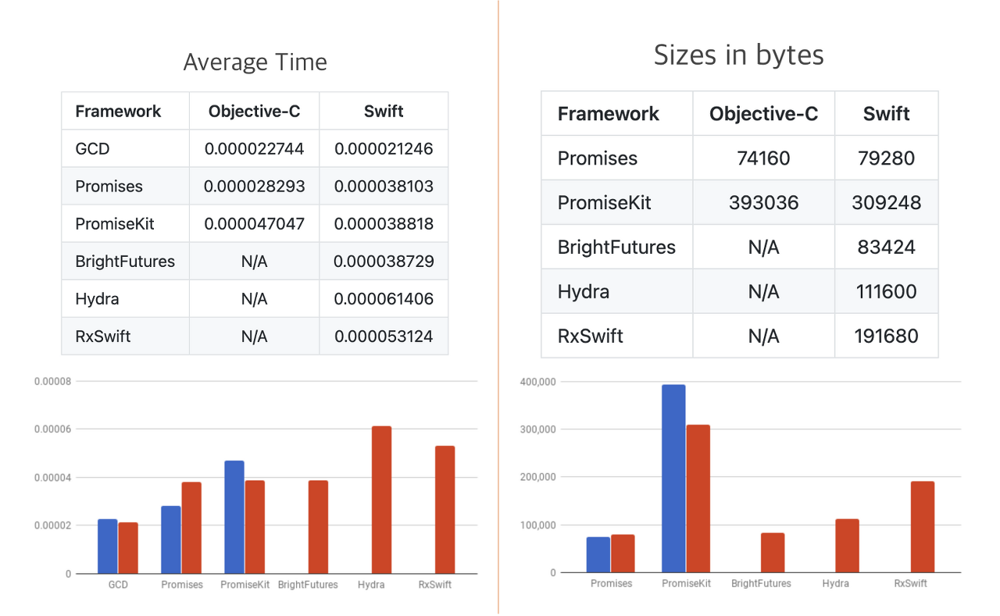
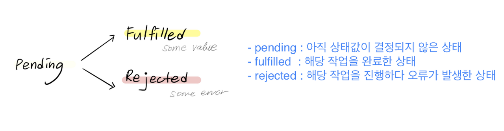

# Promises

보통 Swift에서 비동기 처리를 구현할 때는 delegate 패턴을 사용하거나 RxSwift를 활용하는 등의 방법을 사용한다.

RxSwift는 주로 사용되는 기능들 외의 다른 수많은 기능은 잘 사용되지 않을 때가 있다. 그래서 간단한 프로젝트에서는 사용되지 않는 기능들까지 pod 파일로 가지고 있어야 해서 사용해야하는 메서드에 비해 파일의 양이 방대해진다. 




## Installation

```shell
pod 'PromisesSwift'
```


## What is promises

Promises는 Swift에서 비동기 처리를 Promise라는 객체로 묶어서 그 상태 값이 결정(resolved: fulfill or reject)되면 다음 동작을 할 수 있게끔 구현한 구조이다. 여기서 결정된 상태라는 것은 비동기 처리의 completion을 말한다.

보통 completion handler나 delegate를 사용해서 비동기 처리를 구현하면 중첩 레벨이 늘어나면서 가독성이 떨어지는 경우가 있다. 하지만 Promises를 사용하면 이런 비동기 처리에서의 가독성과 퍼포먼스를 높여줄 수 있다.

예를 들면, 어떠한 다른 스레드에서 일을 처리하다가 main 스레드에서 UI 업데이트를 할 때 다음과 같은 코드가 꼭 들어가야 하는데, 이게 if문 안에 있다면 벌써 tab이 3번이나 들어가게 된다.
```swift
if isSuccess {
	DispatchQueue.main.async {
		self.label.text = "success"
	}
}
```

Promise는 아래 3가지 상태 중 하나를 가질 수 있다.



Promise는 한 번 fulfill이나 reject 상태가 되면 다시 상태를 바꿀 수 없다. 그렇기 때문에 수많은 observer들이 해당 promise가 resolved 되기를 기다리게 된다. 그러다가 resolved되면, fulfilled 되어 observer들에게 value를 전달하거나 rejected되어 error를 전달한다. 그리고 여러 Promise들을 체인 걸듯이 연결해서 서로 다른 스레드에서 비동기적으로 반환되는 값들을 엮어서 사용할 수도 있다.

따라서 Promises는 비동기적인 작업들을 체이닝 형식으로 만들어서 더 쉽게 completion handler를 처리할 수 있도록 한다. 아래 예시와 같은 작업들이 수행이 가능하다.
- 서로 의존적인 비동기 작업들을 엮어서 결국 하나의 completion 블록을 실행하도록 구현할 수 있다.
- 많은 독립적인 비동기 작업들을 하나의 completion 블록으로 동시에 수행할 수 있다.
- 많은 비동기 작업들을 경쟁하듯 실행시켜서 완료할 첫 번째 값을 반환시킬 수 있다.
- 비동기 작업을 retry 할 수 있다.


## Creating promises

Promise를 생성하는데에는 2가지 방식이 있다. 우리가 어떠한 비동기 작업이 끝나고 나서 실행하고 싶은 pending된 promise를 필요로 하는지, 아닌지에 따라 달라진다.

- Create a pending promise
```swift
// Promises use the main dispatch queue by default.
// (on: .main)은 작성하지 않아도 된다.
let promise = Promise<String>(on: .main) { fulfill, reject in
	if success {
		fulfull("Hello")
	} else {
		reject(someError)
	}
}
```

Promise 작업 블록에 비동기 처리가 필요하지 않은 경우에는 do 연산자를 사용해서 더 간결하게 작성할 수도 있다.
```swift
let promise = Promise { () -> String in
	guard success else { throw someError }
	return "Hello"
}
```

또는, 아래와 같이 작성한다면 아래 promise가 반환하는 Promise<String>을 또 다른 스레드가 체인을 걸 수도 있다.
```swift
let promise = Promise { () -> Promise<String> in
	guard success else { throw someError }
	return someOtherOperation()
}
```

그리고 다른 관련된 비동기 작업을 할 필요 없이 그냥 pending된 promise가 필요할 때는 pending()을 사용하면 된다.
```swift
let promise = Promise<Stirng>.pending()
// ...other code
if success { promise.fulfill("Hello") }
else { promise.reject(someError) }
```

- Create a resolved promise
	
가끔 이미 fulfill이나 reject된 promise를 만들어서 사용하는게 편리한 경우가 있는데, 이때는 Promise의 초기값이나 에러를 전달해서 사용한다.
```swift
func data(at url:URL) -> Promise<Data?> {
	if url.absoluteString.isEmpty {
		return Promise(nil)
	}
	return load(url)
}
```


## Observing fulfillment

promise가 resolved 됐을 때 notify되는 그 값을 우리가 사용하기 위해서는 then 연산자를 사용해야한다.
```swift
let numberPromise = Promise(42)

// Return another promise
let chainedStringPromise = numberPromise.then { number in
	return self.string(from: number)
}

// Return any value
let chainedStringPromise = numberPromise.then { number in
	return String(number)
}

// Throw an error
let chainedStringPromise = numberPromise.then { number in
	throw NSError(domain: "", code: 0, userInfo: nil)
}

// Void return
let chainedStringPromise = numberPromise.then { number in
	// ...code
	return number
}	
```

여기서 가장 중요한 점은 여러 promise들을 체이닝할 수 있다는 사실이다.
```swift
func work1(_ string: String) -> Promise<String> {
	return Promise {
		return string
	}
}

func work2(_ string: String) -> Promise<Int> {
	return Promise {
		return Int(string) ?? 0
	}
}

func work3(_ numbser: Int) -> Int {
	return number * number
}.then { num in
	return work3(num)
}.then { value in
	print(value) // 100
}

// 또는
work1("10").then(work2).then(work3).then { value in
	print(value)
}
```


## Observing rejection

reject된 promise는 catch 연산자를 사용해서 notify된 값(error)을 얻을 수 있다.
```swift
number(from: "abc").catch { error in
	print("Cannot convert string to number: \(error)")
}
```

그리고 catch 연산자를 활용해서 체이닝을 한다면 아래와 같은 예시를 볼 수 있다.
```swift
struct CustomError: Error {}

func work1(_ string: String) -> Promise<String> {
	return Promise {
		return string
	}
}

func work2(_ string: String) -> Promise<Int> {
	return Promise { () -> Int in
		guard let number = Int(string), number > 0 else { throw CustomError() }
		return number
	}
}

func work3(_ number: Int) -> Int {
	return number * number
}

work1("abc").then { str in
	return work2(str)
}.then { num in
	return work3(num)
}.then { value in
	print(value)
}.catch { error in
	print("Cannot convert string to number: \(error)")
}
```

[Reference](https://beenii.tistory.com/169)
