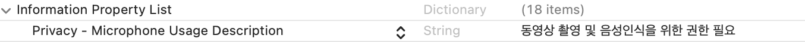
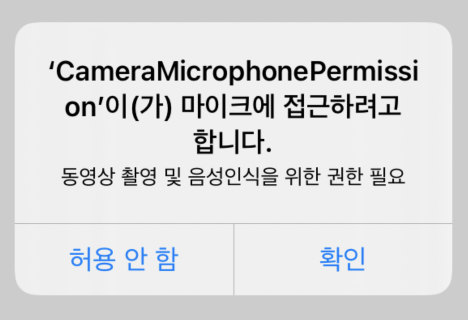

# Microphone Request Permission

> 개발 중 앱에서 음성 접근 권한을 얻는 법을 기록해보자 🧐

우선 `info.plist`에 **key**를 작성한다.

```swift
Privacy - Microphone Usage Description
```

**Value**에는 alert에서 보여줄 **메세지**를 작성한다.



### 이제 코드를 작성한다. 👩‍💻

```swift
import AVKit

func requestMicrophonePermission(){
    AVAudioSession.sharedInstance().requestRecordPermission({(granted: Bool)-> Void in
        if granted {
            print("Mic: 권한 허용")
        } else {
            print("Mic: 권한 거부")
        }
    })
}
```

위 코드를 작성하고,

```swift
override func viewDidLoad() {
    super.viewDidLoad()
    requestMicrophonePermission()
}
```

메서드를 호출하면



이렇게 잘 나오는 것을 볼 수 있다 💁‍♀️
