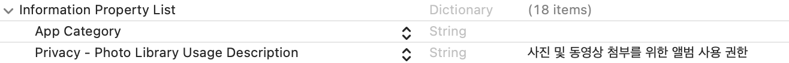
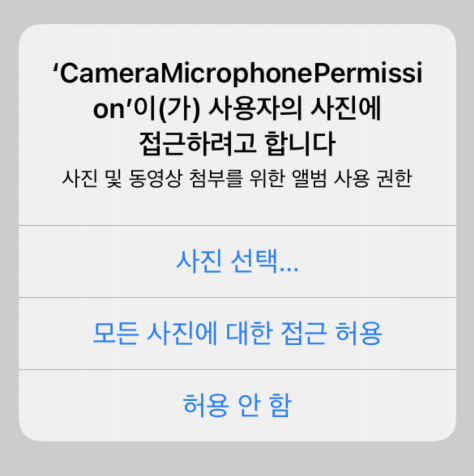

# Photo Library Request Permission

> 개발 중 앱에서 사진첩 접근 권한을 얻는 법을 기록해보자 💡

우선 `info.plist`에 **key**를 작성한다.

```swift
Privacy - Photo Library Usage Description
```

**Value**에는 alert에서 보여줄 **메세지**를 작성한다.



### 이제 코드를 작성한다. 👩‍💻

```swift
import Photos

func requestGalleryPermission(){
    PHPhotoLibrary.requestAuthorization( { status in
        switch status{
            case .authorized:
                print("Gallery: 권한 허용")
            case .denied:
                print("Gallery: 권한 거부")
            case .restricted, .notDetermined:
                print("Gallery: 선택하지 않음")
            default:
                break
        }
    })
}
```

위 코드를 작성하고,

```swift
override func viewDidLoad() {
    super.viewDidLoad()
    requestGalleryPermission()
}
```

메서드를 호출하면



이렇게 잘 나오는 것을 볼 수 있다 ✌️
