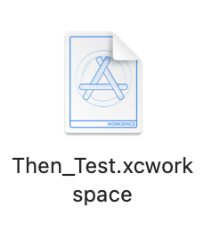

# How to install Then

> Then을 설치하는 방법을 알아보자 📌

CocoaPod을 이용해 설치하기 때문에 우선 Project를 생성한다.

다음과 같은 순서로 터미널에서 작성한다.

```zsh
cd [Project 경로]
```

```zsh
pod init
```

```zsh
open podfile
```

```pod
pod 'Then'
```

위 내용은 `podfile`에 작성한다.

```zsh
pod install
```

까지 해주면



이렇게 `xcworkspace`가 생성된다. **설치된 Then을 사용하려면 이 워크스페이스에서 실행해야한다.**
