# AutoLayout

> 나도 잘 모르지만.. ㅎㅎ 스토리보드로 해보는 AutoLayout !! 강의를 봐도 구글링을 해도 정말 모르겠다는 1학년의 질문에 의해 작성하는 TIL 👩‍💻

## AutoLayout이 뭘까?

정말 직역한 그대로 자동으로 레이아웃을 그려주는 것.

### 어떻게 자동으로 알게 될까?

`위치`와 `사이즈`, 이 두가지가 필요하다.

위치는 `Anchor`를 통해 알게 된다. 해당 View에서의 x, y 위치로 파악하게 된다.

사이즈는 `width`, `height` 즉, 가로 세로 길이를 받거나 `Anchor`기반으로 스크린 사이즈로 자동으로 뷰의 사이즈를 조절하며 레이아웃을 그린다.

### 강의를 보며 우선 따라해보기

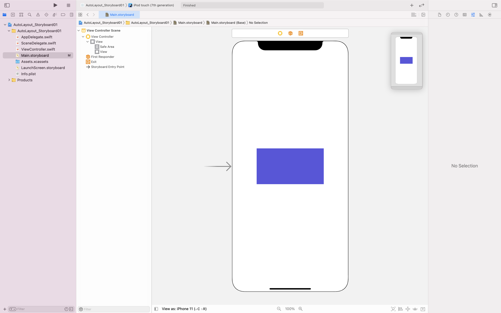

- 우선 View를 추가해준 후 backgroundColor를 변경해준다.

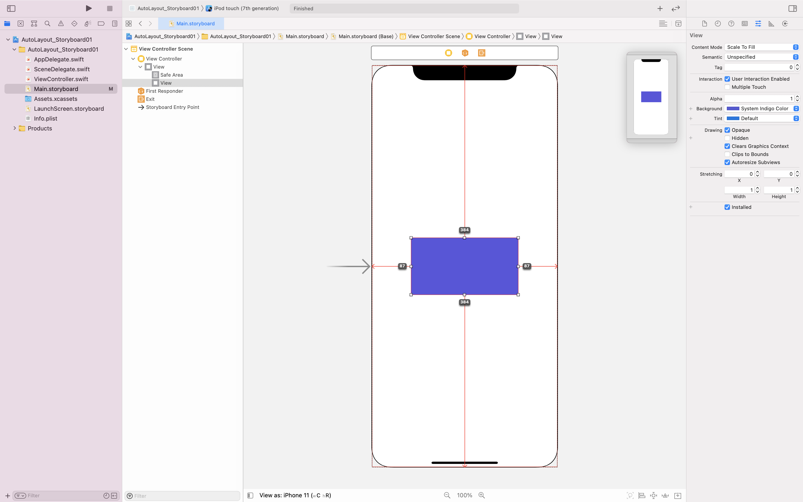

- 해당 요소를 누른 채로 option을 누르면 이렇게 사이즈를 볼 수 있다.

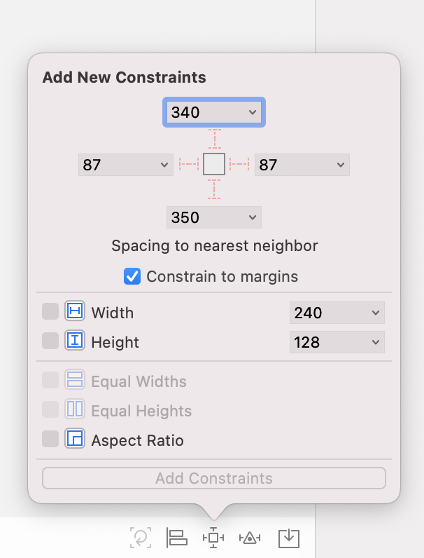

- 이 곳에서 우리는 제약 조건을 줄 수 있다. 저 점선으로 된 부분을 클릭해 실선으로 바꿔주어 위치를 주고, width나 height 부분을 체크한 후 값을 줘 사이즈를 줄 수 있다.

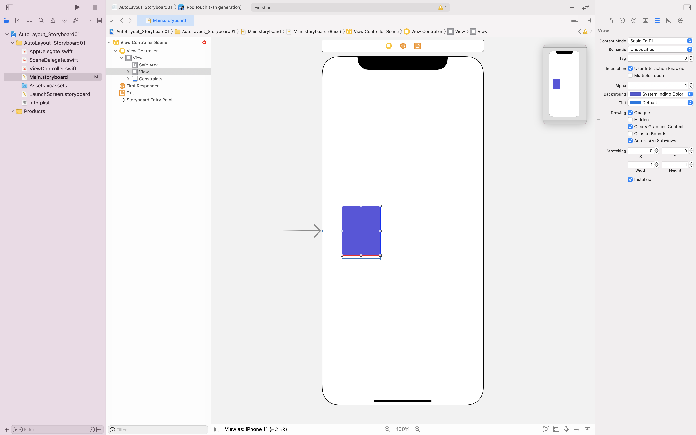

- 지금 이 모습은 left와 width가 자리 잡은 모양이다.

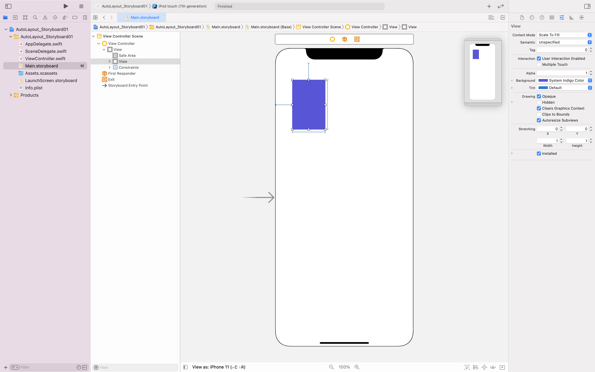

- 이렇게 top과 height까지 주자 모든 선이 파랗게 변했다. 이 모습이 바로 autolayout이 주어졌다는 걸 나타낸다.

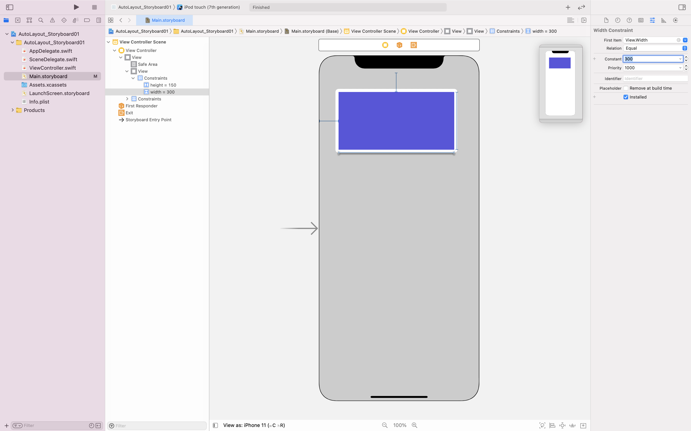

- 변경을 하고 싶을 땐 이렇게 해당 제약 조건을 클릭해 오른쪽 인스펙터 영역에서 변경하거나

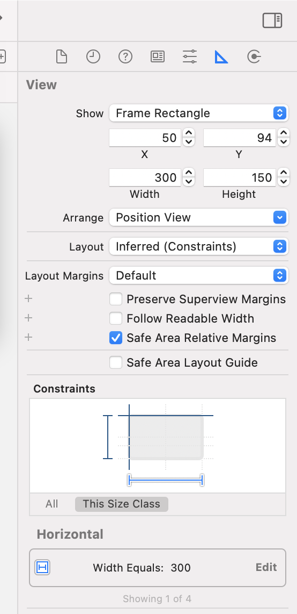

- 인스펙터 부분에서 클릭하여 변경하는 방법이 있다.

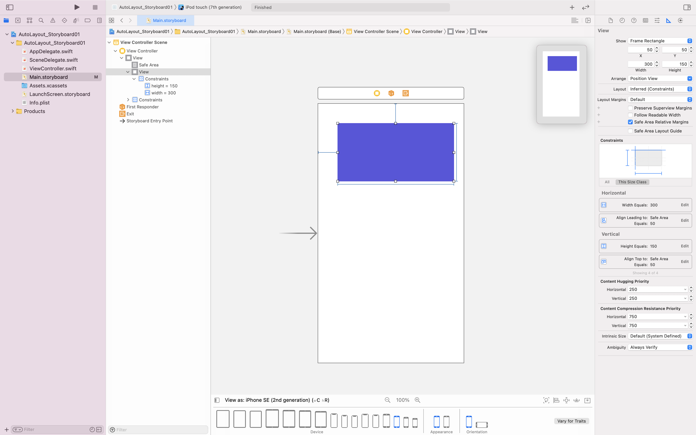

- 이렇게 기기를 변경해보면 비율이 달라진 모습을 볼 수 있다. 이는 고정값을 주었기 때문이다.

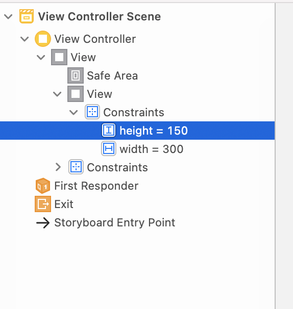

- Constraints를 지우는 방법은 첫번째 해당 Constraints를 클릭해 delete하거나

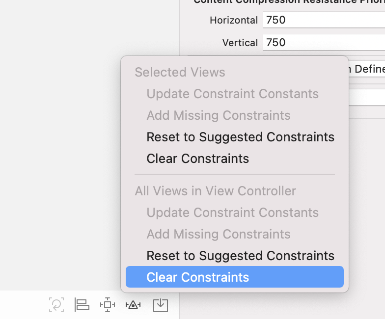

- 하단에 Constraints 오른쪽 버튼을 눌러 Clear Constraints를 누르는 방법이 있다.

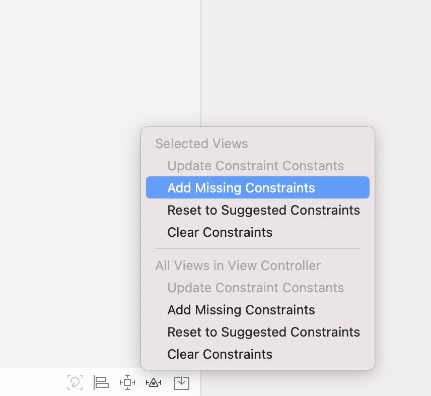

- XCode 자체적으로 Constraints를 주는 방법도 있다. Add Missing Constraints를 클릭하면 자동으로 잡히지 않은 Constraints가 잡힌다.

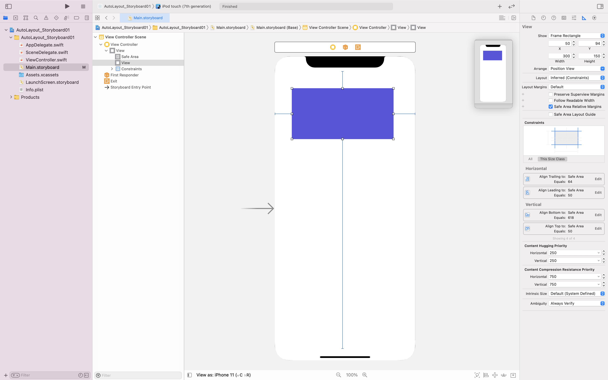

- 자체적으로 잡힌 Constraints를 보면 크기는 주어지지 않는 모습이다. 이를 통해 알 수 있는 건 바로 Anchor만으로 알아서 계산하여 크기를 준다는 것이다.

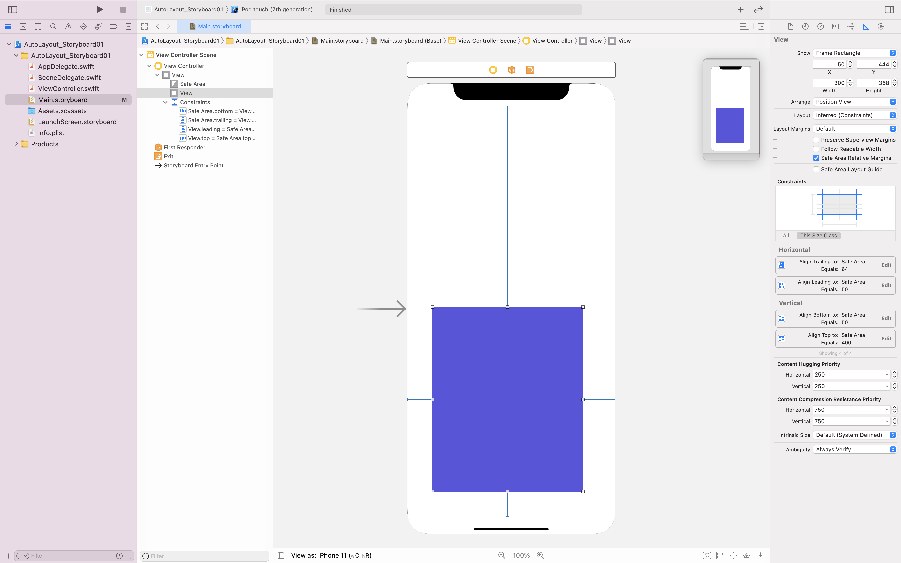

- 이런 식으로 값을 변경하자 알아서 크기가 바뀌는 모습을 볼 수 있다.

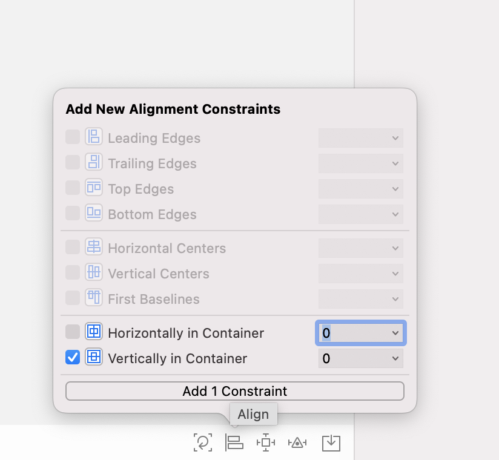

- 이렇게 정중앙에도 걸 수 있는 방법이 있다. 하단에 Constraints 왼쪽 버튼을 눌러 주면 Horizontally와 Vertically가 나온다. 여기서 Horizontally는 x축에서의 중앙이고, Vertically는 y축에서의 중앙을 의미한다.

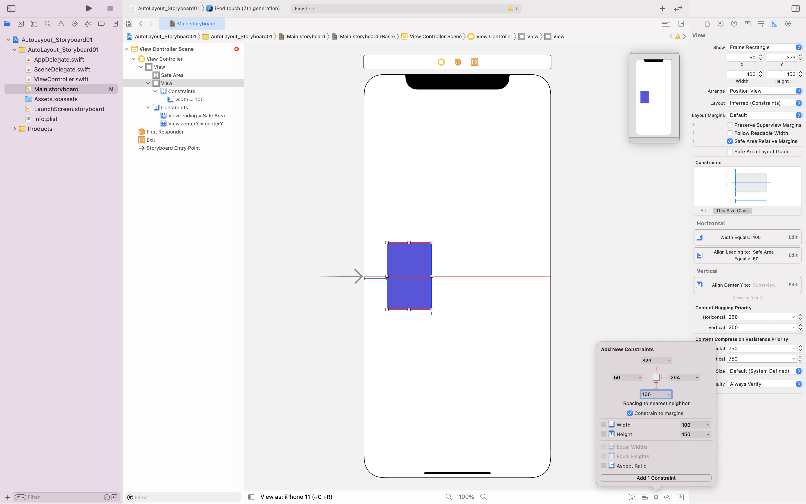

- 자, 여기서 height를 제외하고 나머지 constraint를 준 상태로 bottom을 주면

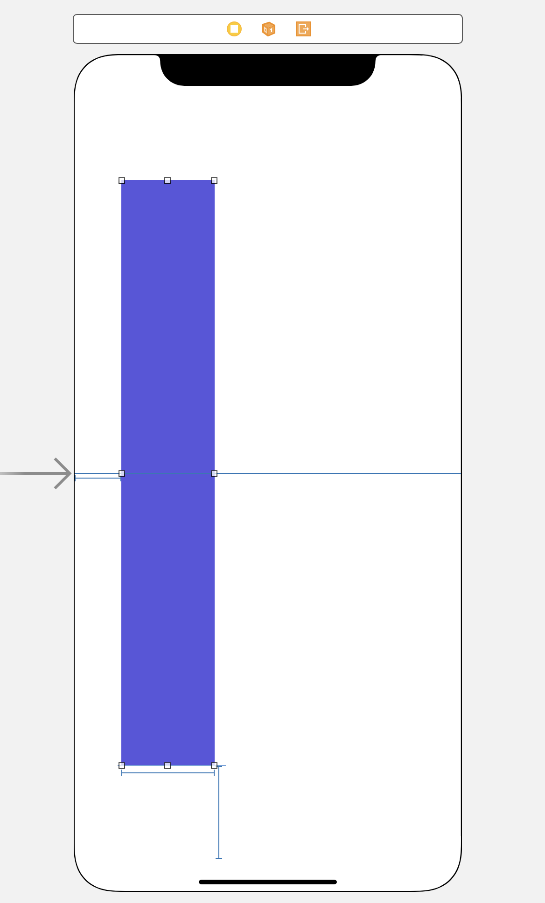

- 이런식으로 top쪽도 자연스레 늘어나는 걸 볼 수 있다. 이는 constraint Vertically를 주었기 때문에 상하 대칭을 유지하는 것이다.

> 해 본 결과 후기 - 스토리보드 편하긴 편하다. 하지만 SnapKit을 이용하는 코드 작성이 나에겐 더 익숙한 것 같다.. 코드 작성이 실력향상엔 더 도움이 된다 🤔
