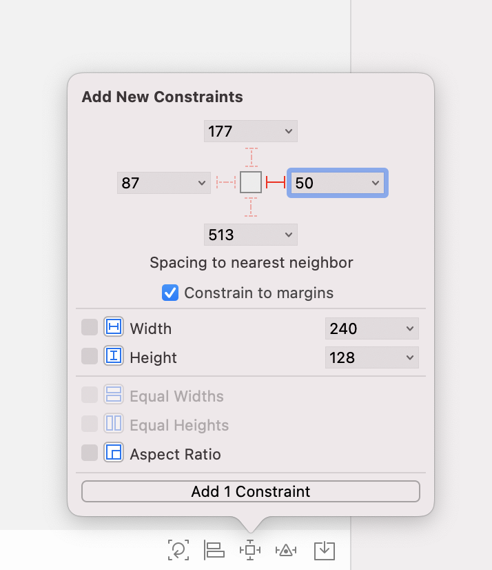
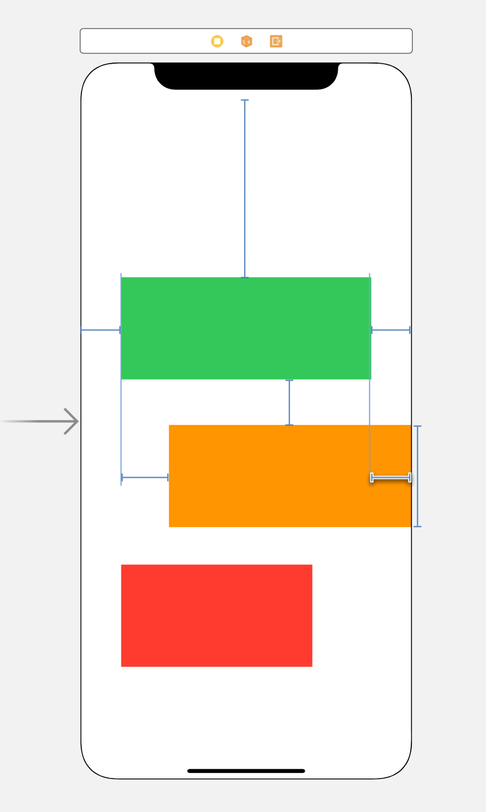

# Constraint

> AutoLayout 중 Constraint에 대해 더 자세히 알아보자! ✍️

### 강의를 보며 우선 따라해보기

- 우선 뷰를 생성한 후 left Constraint를 만들어준다.

- constraint를 클릭하면 현재 greenView는 최상위 View의 Safe Area에 연결된 것을 확인할 수 있다.

- Secont Item을 Trailing으로 바꿔주면

- 이렇게 Safe Area의 Trailing에 연결된 모습을 볼 수 있다.

- 아직 오토레이아웃이 잡히지 않았기 때문에 width 고정값까지 주면

- 이런 조금은 황당(?)한 모습이 된다. 하지만 이건 우리가 준 constraint가 잘 잡힌 것이다. greenView의 왼쪽과 Safe Area의 오른쪽이 연결 된 모습이기 때문이다.

- constant 값을 음수로 작성해주면

- 이렇게 오른쪽에서 빼꼼 나온 greenView의 모습을 볼 수 있다.

- First Item을 greenView의 Trailing으로 변경하고, Constant를 50으로 변경하면

- 이런 모습이 나온다.

- 양수는 오른쪽으로 가는 것이기 때문에 음수값으로 입력해주면

- 이런 모습이 된다.

- 기존의 constraint를 삭제하고 다시 constraint를 적용하면

- 다시 이런 모습이 된다.

- 이렇게 width, height, x, y anchor를 다 준 상태를 보면 현재 겹치는 constraint가 있어 빨갛게 보인다. 이때 이 모습을 보고 알 수 있는 것은 길이보단 위치가 더 우선 순위가 높다는 것이다.

- constraint가 겹치게 되면 이런 빨간 화살표가 등장한다.

- 이것을 클릭해 constraint를 해제할 수 있다.

- width를 삭제해주면 이와 같이 오류 없는 모습을 볼 수 있다.

- 이렇게 view 2개를 더 추가해주고

- 가운데 뷰에 constraint를 주면

- 이렇게 자동으로 위의 view에 constraint가 잡힌다.

- width와 height를 주면 이렇게 오토 레이아웃이 잡힌다.

- SecondItem constraint를 GreenView의 leading까지로 넣어주면

- 이런 모습이 된다.

- width constraint를 삭제하고 오른쪽 constraint를 주면

- 이렇게 width가 자연스럽게 늘어난 것을 볼 수 있다.

- OrangeView의 오른쪽 constraint를 GreenView의 오른쪽으로 변경해주면

- 이런 모습이 된다.

- 여기서 constant까지 0으로 바꿔주면

- 이런 모습이 된다.

- 더 편하게 하는 방법이 있다. 바로 control을 눌러서 drag 하는 방법이다. RedView를 OrangeView로 끌어당긴 다음 leading으로 constraint를 주면

- 이런 모습이 된다.

- 여기서 RedView에 width와 height를 고정값을 주면 저런 모습이 된다.

- constant를 50으로 수정하고 top constraint를 준다.

- 또한 drag를 한 상태에서 option키를 누르면 현 상황과 맞춰서 constraint를 준다.

> 해본 결과 후기 - constraint 주는 게 보통 일은 아니다.. 다신 code를 버리진 않을 것이다ㅜㅜ 😢 Code 그리워 ㅜㅜㅜ

