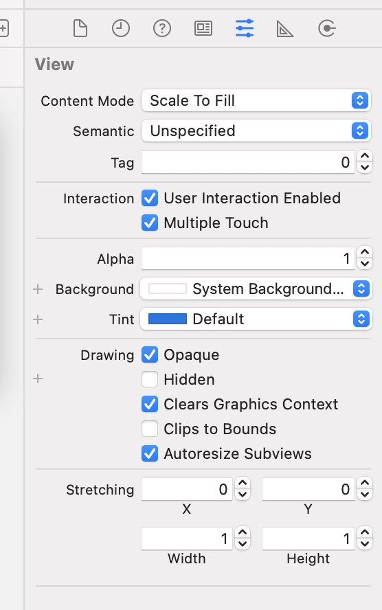
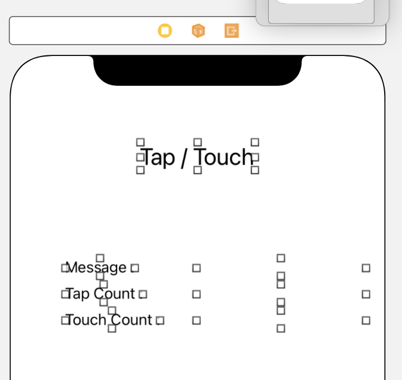
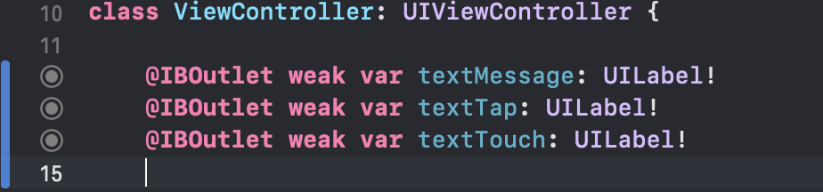

# Tap과 Touch

> 그림판 예제를 찾아보다 발견한 재미난 예제✌️ 알아두면 좋으니 한 번 정리해보자!

Tap Count와 Touch Count를 Label로 표시해주는 예제이다.

- Tap Count : 연속으로 Tap한 수
- Touch Count : 몇 개의 손가락으로 Touch

`여기서 알 수 있는 사소한 지식 🧐`

iOS Simulator에서는 `option`키를 누르면 두 손가락 click이 가능하다!

### 그럼 만들어보자!!

START. 우선 프로젝트를 생성하고 멀티 터치를 활성화 시킨다.



1. `view`를 클릭하고 `Attributes inspector` -> `Multiple Touch`를 체크해준다.



2. 위 화면과 같이 `Label` 총 `7`개를 생성해 준다.
   > `Tap / Touch`, `Message : `, `Tap Count : `, `Touch Count : `, 표시 용 빈 Label `3`개



3. 빈 Label 3개를 각각 `OutLet 변수`로 추가해준다.

4. 코드를 작성해준다.

```swift
    // 터치가 시작 됐을 때
    override func touchesBegan(_ touches: Set<UITouch>, with event: UIEvent?) {
        let touch = touches.first! as UITouch // 발생한 터치 이벤트 가져옴

        textMessage.text = "터치 시작"
        textTap.text = String(touch.tapCount) // touches 세트 안에 포함된 터치 수 출력
        textTouch.text = String(touches.count) // 터치 객체 중 첫번째 객체에서 탭의 개수 가져옴
    }

    // 터치된 손가락이 움직였을 때
    override func touchesMoved(_ touches: Set<UITouch>, with event: UIEvent?) {
        let touch = touches.first! as UITouch

        textMessage.text = "움직임"
        textTap.text = String(touch.tapCount)
        textTouch.text = String(touches.count)
    }

    // 화면에서 손가락이 떨어졌을 때
    override func touchesEnded(_ touches: Set<UITouch>, with event: UIEvent?) {
        let touch = touches.first! as UITouch

        textMessage.text = "터치 끝"
        textTap.text = String(touch.tapCount)
        textTouch.text = String(touches.count)
    }
```

5. 실행한 후 정상적으로 작동하는 지 확인하기!

> 간단하게 swift 내의 함수들을 이용해 Tap과 Touch에 대해 알아보았다!

[Reference](https://moonibot.tistory.com/50)
