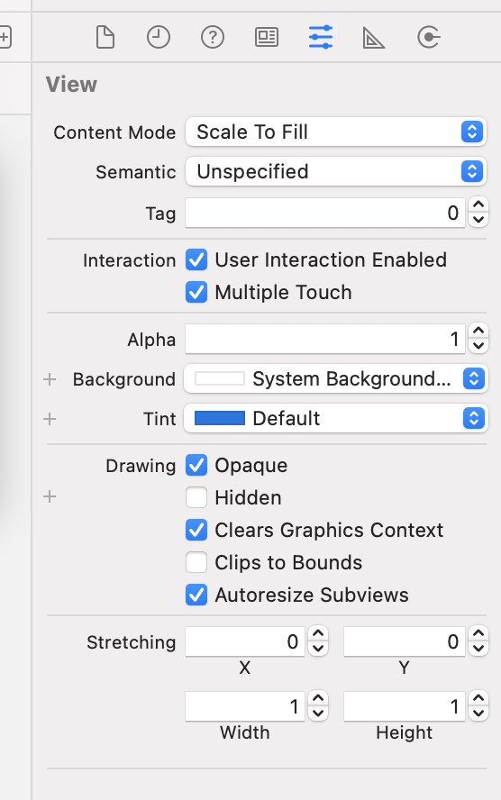
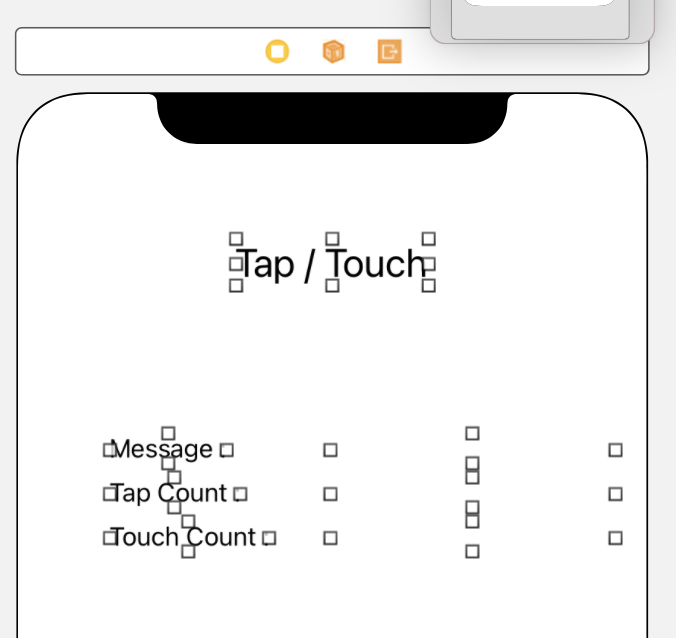
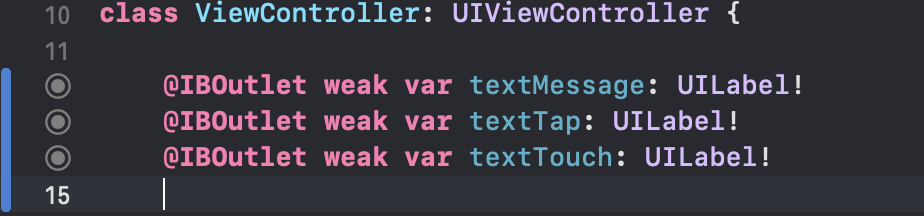

# Tap과 Touch

> 그림판 예제를 찾아보다 발견한 재미난 예제✌️ 알아두면 좋으니 한 번 정리해보자!

Tap Count와 Touch Count를 Label로 표시해주는 예제이다.

- Tap Count : 연속으로 Tap한 수
- Touch Count : 몇 개의 손가락으로 Touch

`여기서 알 수 있는 사소한 지식 🧐`

iOS Simulator에서는 `option`키를 누르면 두 손가락 click이 가능하다!

### 그럼 만들어보자!!

START. 우선 프로젝트를 생성하고 멀티 터치를 활성화 시킨다.

1. `view`를 클릭하고 `Attributes inspector` -> `Multiple Touch`를 체크해준다.

2. 위 화면과 같이 `Label` 총 `7`개를 생성해 준다.
   > `Tap / Touch`, `Message : `, `Tap Count : `, `Touch Count : `, 표시 용 빈 Label `3`개

3. 빈 Label 3개를 각각 `OutLet 변수`로 추가해준다.
