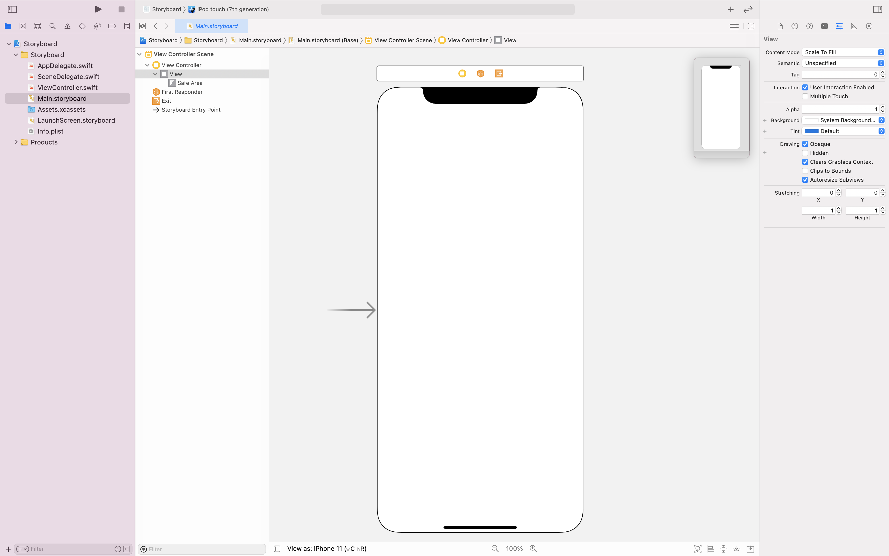
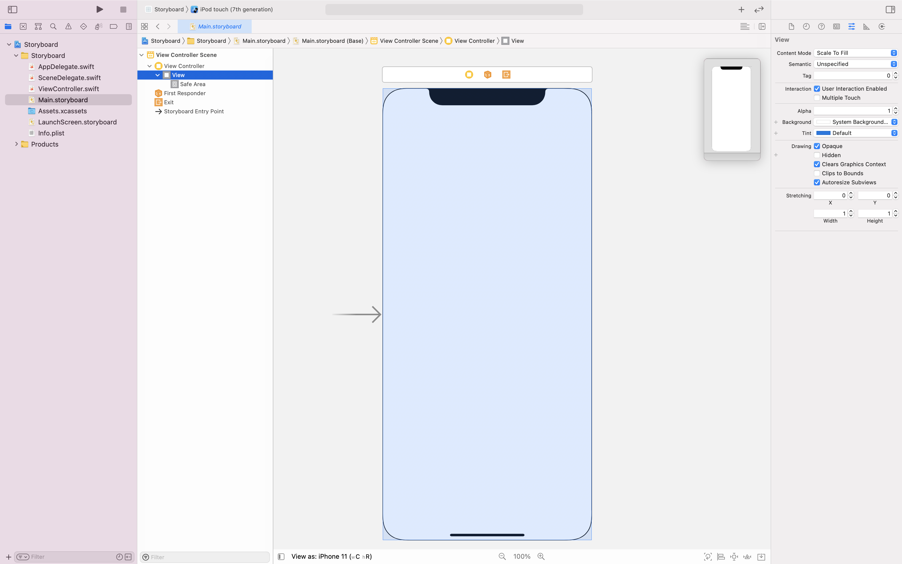
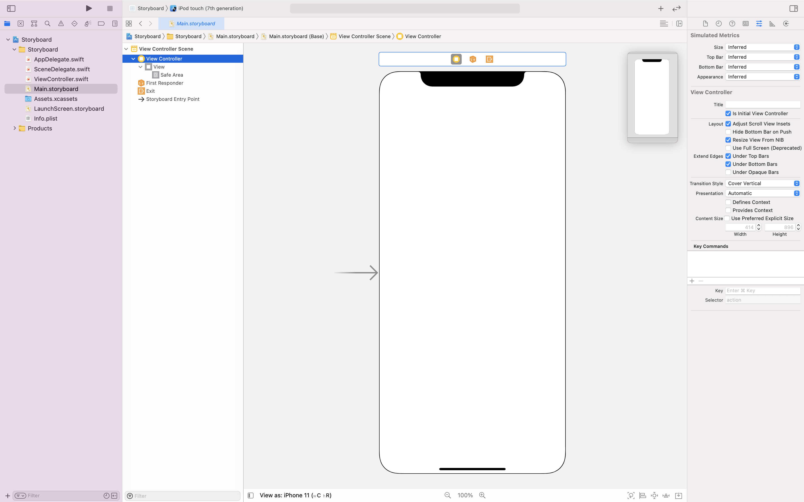
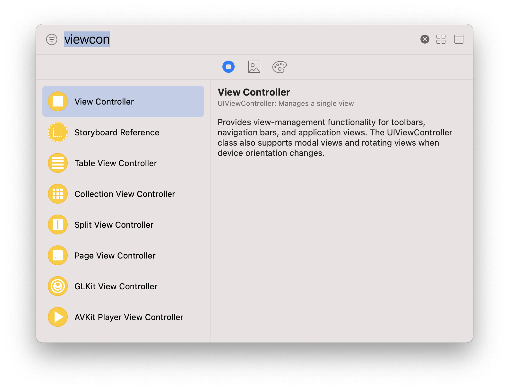
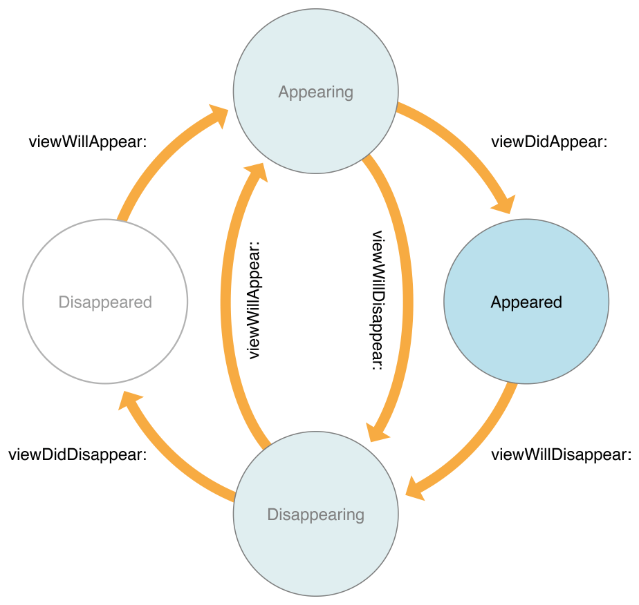

# What is Storyboard?

> 전공동아리 1학년 과제 및 수업을 위해 다시 정리해보았다! 🙌

## Storyboard란?

스토리 보드는 iOS 앱의 사용자 인터페이스를 시작적으로 표햔하여 컨텐츠 화면과 화면 간의 연결을 보여주는 도구이다. 
스토리 보드는 일련의 장면들(scenes)로 구성되며, 각 scene은 뷰 컨트롤러와 해당 뷰를 나타낸다.

## View란?

iOS 앱 사용자 인터페이스의 기본 구성 요소이다. 이를 사용하여 앱의 컨텐츠를 화면에 그리거나 구성할 수 있다. 

## View Controller란?

UIKit을 사용하는 앱의 인터페이스를 관리하기 위한 도구이다.
뷰 컨트롤러는 하나의 루트 뷰 만을 관리하고, 해당 루트 뷰가 여러개의 서브뷰들을 가지는 방식으로 한 화면을 여러개의 뷰로 구성할 수 있다.

## UIKIT이란?

iOS 또는 tvOS 앱을 위한 그래픽 기반의 이벤트 중심 사용자 인터페이스를 구성하고 관리하는 프레임워크이다.

xcode 상단의 ‘+’ 모양 버튼을 누르면 IOS의 화면을 구성하는 ‘오브젝트 라이브러리’들을 확인할 수 있다. 
여기서 View Controller를 찾아 스토리보드로 드래그하면 새로운 화면이 생성된다.

## viewDidLoad()란?

iOS앱의 생명 주기 중 뷰 컨트롤러의 루트 뷰가 스토리 보드에서 만들어 로드 될 때 호출되는 메소드이다.

생명 주기란 앱의 실행부터 종료하기 까지의 일련의 단계를 의미한다.

