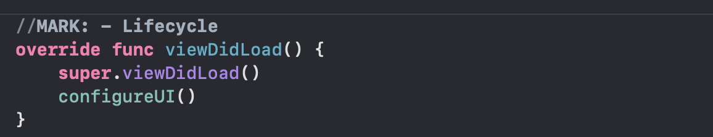

# MARK: -

개발 시 주석 작성은 필수 요소 중 하나이다.
Xcode에서는 단순한 주석이 아닌 구역을 나눠 줄 수 있는 주석 기능을 제공한다

```swift
MARK: - [원하는 내용 작성]
```

자신이 작성하고 싶은 내용을 작성하면 (`MARK: - Property`, `MARK: - Lifecycle`, `MARK: - Selectors` ..etc)



위와 같이 구분선이 생긴다.

이 기능을 잘 활용하면 더 좋은 코드 작성을 할 수 있다.
