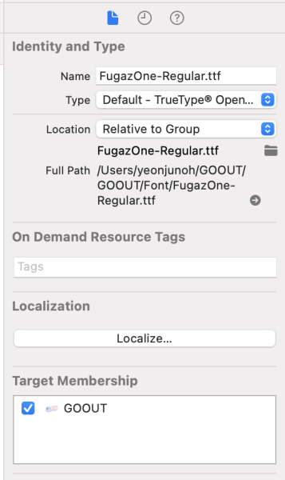

# 경로 연결

> 협업을 진행하다보면 경로 문제로 인해 project 내부 폴더나 파일이 빨갛게 뜬다. 이럴 때 어떻게 해결할까?🤨

- 설명에 사용한 이미지는 모두 예시이다.

이런 식으로 `pull`을 받거나 새 `branch`를 생성하면 이렇게 빨갛게 보이곤 한다.

이 폴더 혹은 파일을 클릭하고 오른쪽 창을 확인하면

연결된 경로가 보인다.

이때 저 폴더 버튼을 누르면 **Finder**가 뜨면서 경로 연결할 폴더 혹은 파일을 선택할 수 있다.

그렇게 하면 연결 완료!!

### 여기서 잠깐! 이런 일을 막기 위해서는? 😣

처음 프로젝트를 생성할 때 **폴더 구조를 잘 지켜** 폴더 안에 해당 파일을 잘 위치시켜줘야한다.
다운로드 경로나 데스크탑 경로 등 자신이 둔 곳을 기준으로 연결시키면 `pull` 받을 시 폴더 안에 파일은 없는 상태이기 때문에 같이 하는 구성원들에게는 보이지 않게 된다.

그렇다고 절대경로를 이용하라는 것은 아니다. 상대경로를 쓰는 대신 모두가 사용할 수 있도록 레포 폴더 안에서의 구조를 지켜야한다는 것이다.
