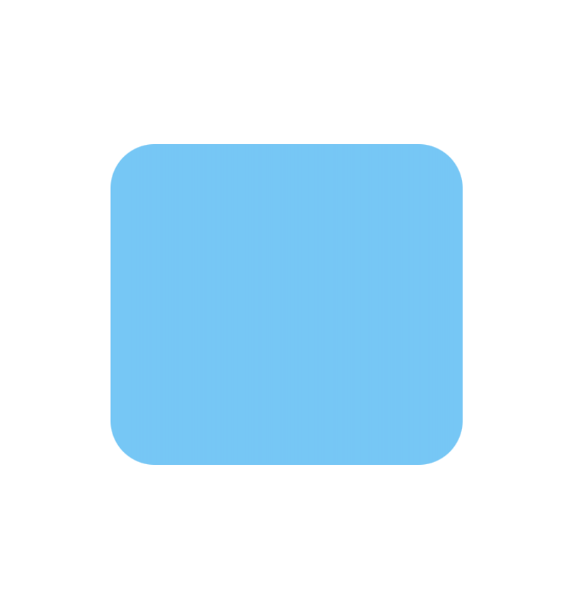
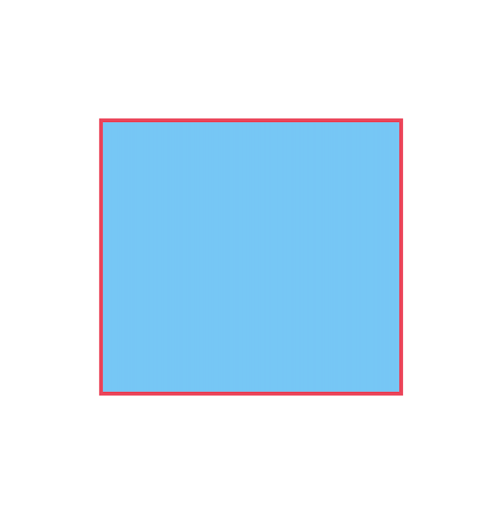

# CALayer

**UIView**는 **CALayer** 타입의 `layer`라는 속성을 가지고 있다.

#### 이 **layer**를 그림자나 테두리, radius 등 쓰는 경우가 많은데 이에 대해 자세히 알아보자! 🎨

### CALayer?

우선 CALayer에 접두사 **CA**는 **C**ore **A**nimation의 약자이다.

Core Animation에 대해 알아보기 전에, iOS에서 그래픽에 어떻게 접근하게 된 것인지 알아보자.


우리가 iOS 어플을 사용할 때 끊기지 않고 부드럽게 그려지게 만들기 위해선 초당 60 프레임 속도를 유지해야한다.
따라서, 초당 60 프레임 속도를 계속 유지하기 위해, GPU에서 직접 실행되는 그래픽에 강력한 `OpenGL`이 생겼다.

이 `OpenGL`의 최대 장점은 그래픽 하드웨어에 **가장 빠르게 엑세스** 할 수 있다는 점이다. 하지만 **단순한 작업에도 코드 양이 매우 많아진다**.

따라서 OpenGL보다 더 적은 코드로 그래픽을 구현할 수 있는 `Core Graphics`라는 것을 만들었다.
(CGColor, CGRect 등등이 여기 속한다.)
근데 이 Core Graphics도 작업이 쉽지 않아(Low Level) 더 간단하게 만들자! 해서 만든 것이 **Core Animation**이다.

그런데 여기서 끝이 아니다. Core Animation에는 그래픽에 접근하는 많은 기능이 들어있는데 **앱 만들 때 이 고급 기능들이 다 필요할까?**라고 생각한 애플은 Core Animation을 또 간단하게 만들었는데 이게 바로 **UIKit**이다. 따라서 우린 UIKit을 통해 최고 High Level에서 그래픽에 접근을 할 수 있었다.

**단점**이라고 하면 계속 단순화 시켜왔기 때문에 사용하긴 편할지 몰라도, 가장 Low Level인 Open GL의 **기능보다는 적은(제한된) 기능을 제공**할 수밖에 없다. (상위 레벨로 갈수록 하위 레벨의 모든 기능을 다루진 못하기 때문)

이런 과정 덕분에 우리는 `UIKit`에 속한 `UIView`를 이용하여 `OpenGL`을 몰라도 화면을 마음대로 그릴 수 있었다.

하지만 우리가 화면에 그리는 UIView는 레이아웃, 터치 이벤트 등 많은 작업을 처리하긴 하지만 사실은 뷰 위에 컨텐츠나 애니메이션을 그리는 행위를 **직접 하지는 않는다**.

UIView는 직접 화면에 그리는 시각적 행위를 Core Animation에게 위임하는데 그게 바로 **layer**라는 CALayer 타입의 속성을 통해서 하는 것이다.

### UIView에서 CALayer의 구성

UIView는 **하나의 CALayer(Root)만** 가지고 있는 반면 CALayer(Root)는 **SubLayer를 여러 개** 둘 수 있다.

즉, UIView의 SubView는 UIView의 CALayer(Root) 위에 얹혀 지는 것이다.

그림으로 보면 아래와 같다.


UIView에는 layer라는 CALayer 하나만 갖고 있지만, layer는 CALayer를 자신의 SubLayer로 여러 개 둘 수 있다. (마치 UIView의 계층 구조처럼)

## CALayer 사용 예제 👩‍💻

### 1. View의 모서리를 둥굴게 만들 때

```swift
layerView.layer.cornerRadius = 30
```



### 2. View의 테두리를 만들 때

```swift
layerView.layer.borderColor = UIColor.systemPink.cgColor
layerView.layer.borderWidth = 3
```



### 3. View에 CALayer를 통해 그림을 그릴 때

CALayer는 자신의 SubLayer를 여러개 둘 수 있다.

```swift
let layer1: CALayer = CALayer()
layer1.frame = .init(x: 10, y: 10, width: 50, height: 50)
layer1.backgroundColor = UIColor.red.cgColor

let layer2: CALayer = CALayer()
layer2.frame = .init(x: 70, y: 10, width: 50, height: 50)
layer2.backgroundColor = UIColor.blue.cgColor

let layer3: CALayer = CALayer()
layer3.frame = .init(x: 130, y: 10, width: 50, height: 50)
layer3.backgroundColor = UIColor.yellow.cgColor

layerView.layer.addSublayer(layer1)
layerView.layer.addSublayer(layer2)
layerView.layer.addSublayer(layer3)
```


마치 `subView`를 한 것처럼 원하는 frame을 그릴 수 있다.

물론 `UIView`로도 위와 같은 그림을 만들 수 있지만 UIView를 여러 개 생성하는 것보다, `CALayer`를 여러 개 생성하는 것이 **훨씬 더 가볍다고 한다**. 따라서 UIView보다 나은 퍼포먼스를 기대할 수 있다.

## CALayer의 성능 문제 해결

CALayer로 애니메이션을 만드는 등 많은 효과를 넣으면 성능상에 문제를 일으켜 **속도가 현저히 저하**된다고 한다. 이때 성능 상 문제 해결을 도와주는 프로퍼티가 있다.

### shouldRasterize

```swift
layerView.layer.shouldRasterize = false
```

CALayer를 그릴 때 오직 한 번만 렌더링 할 건지에 대한 여부를 지정하는 속성으로 default 값은 `false`이다.

`true` = 레이어의 컨텐츠를 처음 한 번만 렌더링 하고 이후 애니메이션부턴 **재활용됨**

`false(default)` = 애니메이션 될 때마다 레이어의 모양을 **다시 그림**

<u>레이어의 컨텐츠가 화면 주변에서 움직이기는 하나, **모양은 변하지 않을 경우**</u> 사용하기에 적합하다.
